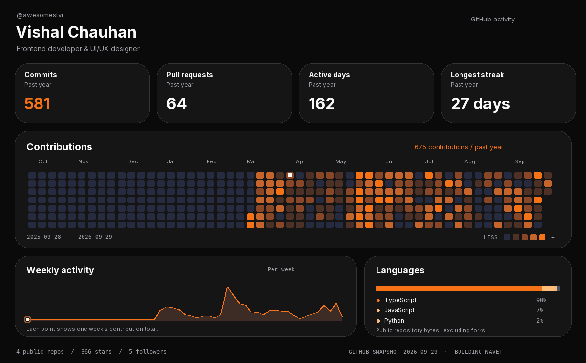

  <a href="https://github.com/awesomestvi?tab=repositories">Repositories</a> ·
  <a href="assets/dashboard.png">Still image</a>

I'm **Vishal Chauhan**, a frontend developer and UI/UX designer. I build [Navet](https://navet.app/), a local-first smart-home dashboard.

**TypeScript · React · CSS · UI/UX**
